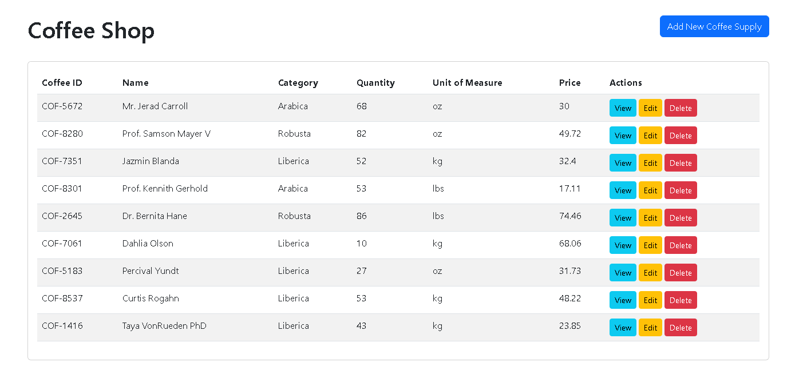
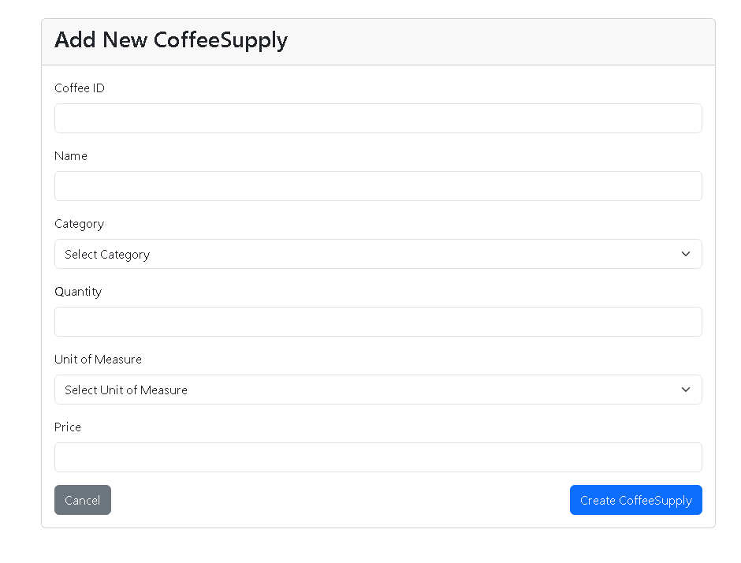
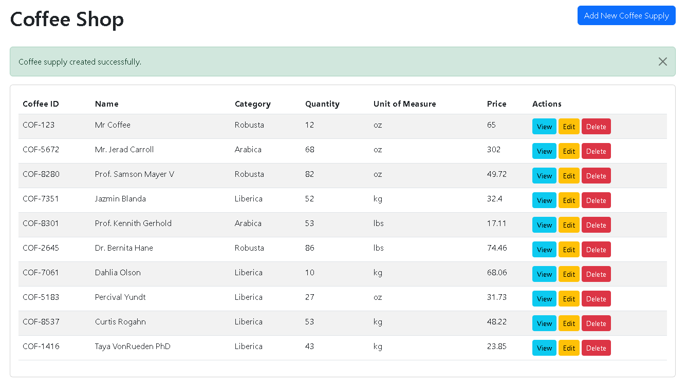
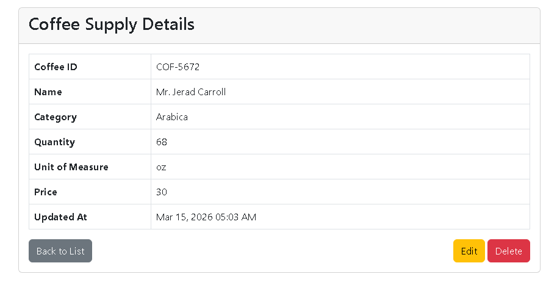
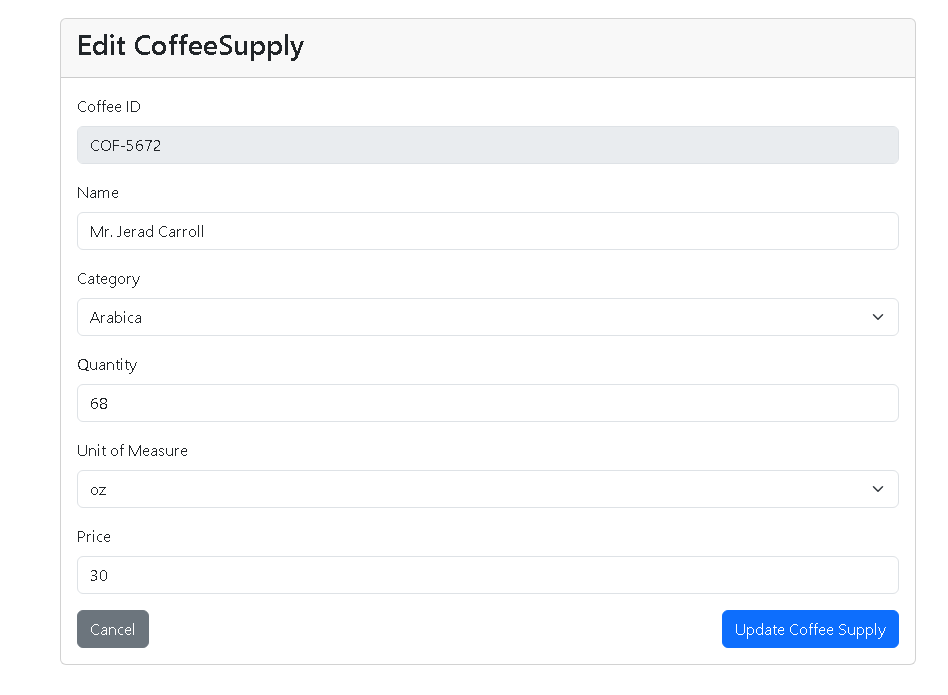
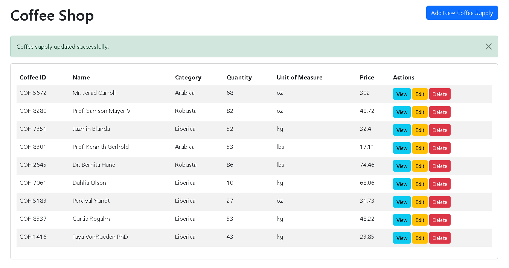
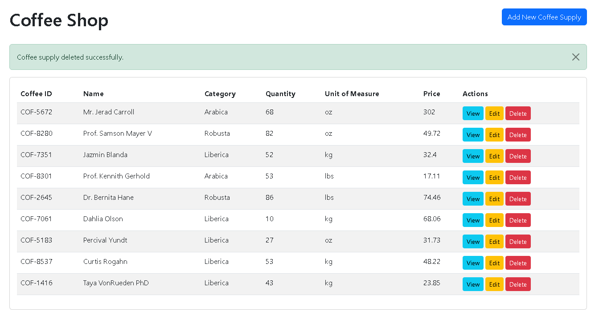

# Coffee Supply Management System

## Database Table Fields (`coffee_supplies`)

- `uuid`
- `coffee_id`
- `name`
- `category` (Arabica, Robusta, Liberica)
- `quantity`
- `unit_of_measure` (kg, lbs, oz)
- `price`
- `created_at`
- `updated_at`

## CRUD Operations Screenshot

### 1) Index

### 2) Create

### 3) Store

### 4) Show

### 5) Edit

### 6) Update

### 7) Destroy

